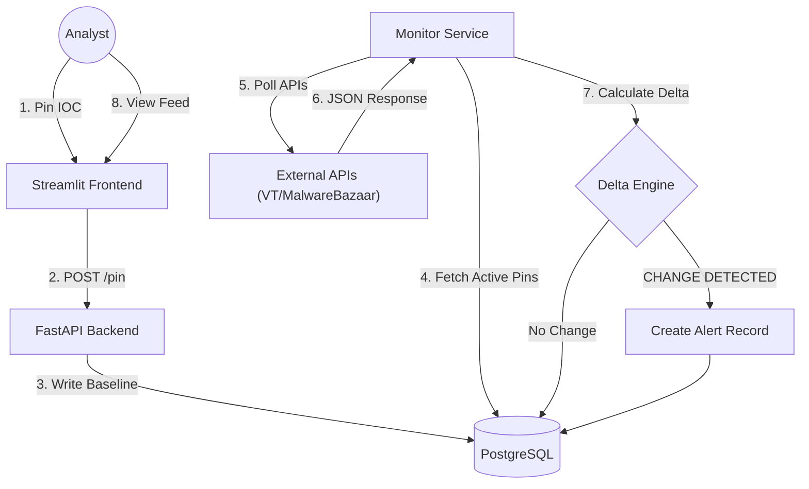

# TIPinBoard: Automated Workbench for Threat Intelligence

[](https://opensource.org/licenses/MIT)
[](https://www.docker.com/)
[](https://fastapi.tiangolo.com/)
[](https://streamlit.io/)

**TIPinBoard** is an open-source, longitudinal tracking workbench for Cyber Threat Intelligence (CTI) analysts. It facilitates the automated lifecycle management of Indicators of Compromise (IOCs) by shifting the operational paradigm from passive, point-in-time data collection to **active, state-change monitoring**.

The system addresses the "stale intelligence" problem by establishing a temporal baseline for monitored assets and algorithmically detecting significant deviations (Deltas)—such as changes in detection ratios, DNS resolutions, or WHOIS data—thereby reducing alert fatigue and focusing analyst attention on evolutionary threats.

---
**TIPinBoard** turns your static Indicators of Compromise (IOCs) into active intelligence traps.

# The "Bingo" Moment
Imagine this: You are investigating a suspicious domain. It currently resolves to a parking page and shows "Clean" on VirusTotal. Most analysts would archive it and move on.

You pin it to **TIPinBoard**. Two days later, you get a notification: **Delta Alert**.
> *Domain resolution changed from `0.0.0.0` to `45.x.x.x`.*

**Bingo.** You just caught a Command & Control (C2) server "waking up" in real-time, long before it appears on public blocklists. TIPinBoard automates this longitudinal tracking, shifting the paradigm from passive looking to active hunting.

---

## 🚀 Key Value Proposition

### The Problem: Stale Intelligence
Adversaries rotate infrastructure rapidly to evade detection. A Command & Control (C2) domain may only be active for 24 hours, or a malware hash may transition from "Clean" to "Malicious" days after initial scanning. Traditional workflows, which rely on manual re-verification or static spreadsheets, fail to capture this dynamic evolution, leading to missed pivots and reactive posturing.

### The Solution: The Delta Engine
TIPinBoard employs a specialized **Delta Engine** that treats threat data as a time series rather than a snapshot.
1.  **Pin:** The analyst "pins" an IOC (Hash, Domain, or IP) to a campaign board.
2.  **Snapshot:** The system acquires a verifiable baseline state.
3.  **Monitor:** A scheduled background worker polls high-fidelity APIs (VirusTotal, MalwareBazaar) while respecting rate limits.
4.  **Delta Detection:** If $State_{t1} \neq State_{t0}$, the engine calculates the variance. Significant changes generate a **Delta Alert**.

---

## ✨ Features

* **Longitudinal Monitoring:** Automatically tracks the history of an IOC over time, preserving a chain of JSON snapshots for retrospective analysis.
* **Infrastructure Pivoting:** autonomously detects and alerts on new relationships, such as a monitored malware sample communicating with a previously unknown C2 IP.
* **Smart Alerting:** Reduces cognitive load by filtering out static noise; analysts are notified only when specific metrics (e.g., AV detection count, resolution IPs) change.
* **Asynchronous Architecture:** Built on a decoupled microservices architecture to handle high-latency external API polling without blocking the user interface.
* **Campaign Management:** Organize IOCs into distinct "Pinboards" for focused tracking of specific APT groups or malware families.

---

## 🛠️ Technical Architecture

TIPinBoard utilizes a decoupled microservices architecture containerized via Docker.

* **Frontend:** Streamlit (Python) for the interactive analyst dashboard.
* **Backend:** FastAPI (Python) serving REST endpoints for data management.
* **Database:** PostgreSQL for structured, persistent storage of Time-Series snapshots.
* **Monitor Service:** A standalone Python worker utilizing `APScheduler` for asynchronous API polling and Delta calculation.

### System Data Flow


## ⚡ Getting Started

### Prerequisites

* **Docker** and **Docker Compose** installed on your machine.
* API Keys for **VirusTotal** (Required) and **MalwareBazaar** (Recommended).

### Installation

1. **Clone the Repository**
```bash
git clone [https://github.com/vaibhavspandey/ThreatIntel-Pinboard.git](https://github.com/vaibhavspandey/ThreatIntel-Pinboard.git)

cd ThreatIntel-Pinboard

```


2. **Configure Environment Variables**
Create a `.env` file in the root directory.
```bash
cp .env.example .env

```


Update the `.env` file with your credentials:
```ini
VIRUSTOTAL_API_KEY=your_vt_api_key
MALWAREBAZAAR_API_KEY=your_mb_api_key

```


3. **Deploy with Docker**
```bash
docker-compose up --build -d

```
###### or you can also use ./openpinboard


4. **Access the Application**
* **Dashboard:** `http://localhost:8501`
* **API Documentation:** `http://localhost:8000/docs`


---
## ⚙️ Configuration

TIPinBoard works out-of-the-box, but you can customize the monitoring behavior by adding these optional variables to your `.env` file.

| Variable | Description | Default | Required |
| :--- | :--- | :--- | :--- |
| `VIRUSTOTAL_API_KEY` | Your VirusTotal API v3 Key. | - | **Yes** |
| `MALWAREBAZAAR_API_KEY` | Your MalwareBazaar API Key. | - | No |
| `POLL_INTERVAL_MINUTES` | How often the monitor checks active pins (in mins). | `60` | No |
| `POSTGRES_USER` | Database username. | `user` | No |
| `POSTGRES_PASSWORD` | Database password. | `password` | No |
| `POSTGRES_DB` | Database name. | `ti_watchlist` | No |
| `LOG_LEVEL` | Logging verbosity (DEBUG, INFO, ERROR). | `INFO` | No |

## 📖 Usage Workflow

1. **Create a Pinboard:** Create a named board for your investigation (e.g., "Qakbot Campaigns").
2. **Add Pins:** Input IOCs (IPs, Domains, or File Hashes). The system immediately fetches the initial baseline.
3. **Automated Monitoring:** The Monitor Service runs in the background (default interval: 60 minutes). No user action is required.
4. **Review Deltas:** Check the "Activity Feed" on the dashboard for generated alerts.
* *Example:* `[ALERT] Hash <abc...> detection ratio changed from 0/70 to 15/70.`
* *Example:* `[PIVOT] Domain <evil.com> resolved to NEW IP <192.0.2.1>.`


---
## ❓ Troubleshooting & FAQ

**Q: I am seeing `429 Too Many Requests` errors in the logs.**
**A:** This means you have hit the rate limit of your External API keys (e.g., VirusTotal Free Tier allows only 4 requests/minute).
* **Fix:** TIPinBoard's scheduler attempts to handle this automatically, but if you pin hundreds of IOCs on a free key, you will see these errors. The system will retry them in the next cycle.

**Q: The Dashboard isn't loading (Connection Refused).**
**A:** Ensure all Docker containers are running healthy.
* Run `docker-compose ps` to check status.
* If the `frontend` container exits immediately, check if it can reach the `backend` service name in your Docker network.

**Q: How do I backup my data?**
**A:** All data is stored in the PostgreSQL volume. You can backup the `ti_watchlist_data` Docker volume to save your campaign history.

## 🤝 Contributing

Contributions are welcome! This tool is designed to be community-driven.

### How to Contribute

1. **Fork** the repository.
2. Create a **Feature Branch** (`git checkout -b feature/NewConnector`).
3. **Commit** your changes.
4. **Push** to the branch.
5. Open a **Pull Request**.

### Planned 🔮 Roadmap
* [ ] **Screenshots:** Add high-quality screenshots of the "Delta Feed" and "Pin Creation" flows to the README.
* [ ] **LLM Integration:** Integration of local LLMs to generate semantic summaries of complex JSON differences.
* [ ] **TIP Integration:** Native connectors for MISP and OpenCTI to support automated export of confirmed alerts.
* [ ] **Notification Webhooks:** Support for Slack/Microsoft Teams webhooks for real-time alerting.
* [ ] **Other Ideas Welcome** I'd love your Ideas on where this can go!
```
The following features are planned to enhance TIPinBoard’s analytic depth and operational efficiency. These updates focus on providing clearer telemetry for analysts and more robust handling of large-scale IOC monitoring.
1. Advanced Threat Timelines (Competitive Analytics)
Objective: Implement a graphical "Race to Detection" view to visualize platform parity and lead times.
Feature Detail: A new top-level sidebar view utilizing Plotly/Altair to map the detection lifecycle of an IOC across multiple providers (VirusTotal, MalwareBazaar, urlscan.io, and Neiki TIP)
Analytic Value: Specifically identifies which platform flagged a threat first, providing metadata on the "Competitive Element" of vendor detection speed.
Granularity: Hourly event tracking with explicit status labels (e.g., "Benign" vs. "Malicious").
2. Enhanced Orchestration & Rate-Limit Spreading
Objective: Optimize API consumption for high-volume IOC watchlists.
Feature Detail: Transition from "Burst Polling" to "Load-Balanced Polling." Instead of scanning all IOCs at the start of the hour, the system will implement a temporal distribution algorithm to spread requests evenly across the 60-minute window.
Observability: Integration of a "Last Scanned" telemetry field next to each Pin in the UI to provide analysts with immediate verification of intelligence freshness.
3. Intelligence Fidelity & Cross-Platform Correlation
Objective: Harmonize disparate data sources for a unified threat view.
Feature Detail: Expansion of the Delta Engine to correlate "Quiet" signals. For example, flagging a "Benign" status on VirusTotal that occurs simultaneously with a "Malicious" verdict on urlscan.io, highlighting potential detection gaps in major repositories.
Community Contribution: Continued expansion of the connectors.py service to support additional open-source and commercial intelligence feeds.
4. Enterprise-Grade UX & Input Sanitization
Objective: Harden the system against malformed data and improve operational flow.
UI/UX Synchronicity: Implementation of asynchronous spinners and automatic cache invalidation (st.cache_data.clear()) to ensure the dashboard reflects the database state immediately after a new Board or Pin is created.
Robust Input Schema: A dedicated validation layer to sanitize and normalize inputs (Hashes, IPs, Domains, and URLs) before they reach the monitoring pipeline, preventing injection and ensuring API compatibility.
State Management: Improving form handling to ensure input fields automatically reset upon successful submission without requiring a manual page refresh.
🛠 Questions for the Community / Contributors:
Schema Extension: Would you prefer the "Last Scanned" timestamp to be stored in the Pins table or derived dynamically from the latest Snapshot?
Timeline Visualization: For the "Threat Timelines" view, should we prioritize a "Gantt-style" lead-time chart or a standard time-series line graph?
Webhook Support: Should we prioritize Discord/Slack webhooks as part of the "Competitive Alerting" logic?
```
```
````
## 📸 Screenshots

<p align="center">
  
  <br>
  <em>Dashboard View</em>
</p>

<p align="center">
  
  <br>
  <em>Live Monitoring</em>
</p>

<p align="center">
  
  <br>
  <em>Alert History</em>
</p>


```
## 🛡️ License

This project is licensed under the MIT License - see the [LICENSE](https://www.google.com/search?q=LICENSE) file for details.

---

## 📧 Contact

**Vaibhav Pandey** Project Link: [https://github.com/vaibhavspandey/ThreatIntel-Pinboard](https://github.com/vaibhavspandey/ThreatIntel-Pinboard)

```

```
