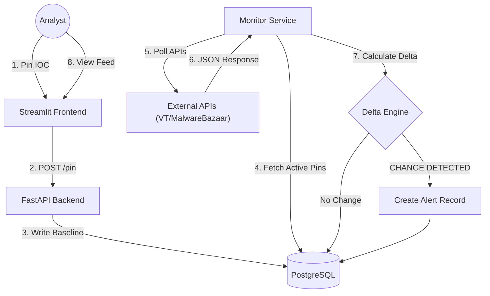

# TIPinBoard: Automated Workbench for Threat Intelligence

[](https://opensource.org/licenses/MIT)
[](https://www.docker.com/)
[](https://fastapi.tiangolo.com/)
[](https://streamlit.io/)

**TIPinBoard** is an open-source, longitudinal tracking workbench for Cyber Threat Intelligence (CTI) analysts. It facilitates the automated lifecycle management of Indicators of Compromise (IOCs) by shifting the operational paradigm from passive, point-in-time data collection to **active, state-change monitoring**.

The system addresses the "stale intelligence" problem by establishing a temporal baseline for monitored assets and algorithmically detecting significant deviations (Deltas)—such as changes in detection ratios, DNS resolutions, or WHOIS data—thereby reducing alert fatigue and focusing analyst attention on evolutionary threats.

---

## 🚀 Key Value Proposition

### The Problem: Stale Intelligence
Adversaries rotate infrastructure rapidly to evade detection. A Command & Control (C2) domain may only be active for 24 hours, or a malware hash may transition from "Clean" to "Malicious" days after initial scanning. Traditional workflows, which rely on manual re-verification or static spreadsheets, fail to capture this dynamic evolution, leading to missed pivots and reactive posturing.

### The Solution: The Delta Engine
TIPinBoard employs a specialized **Delta Engine** that treats threat data as a time series rather than a snapshot.
1.  **Pin:** The analyst "pins" an IOC (Hash, Domain, or IP) to a campaign board.
2.  **Snapshot:** The system acquires a verifiable baseline state.
3.  **Monitor:** A scheduled background worker polls high-fidelity APIs (VirusTotal, MalwareBazaar) while respecting rate limits.
4.  **Delta Detection:** If $State_{t1} \neq State_{t0}$, the engine calculates the variance. Significant changes generate a **Delta Alert**.

---

## ✨ Features

* **Longitudinal Monitoring:** Automatically tracks the history of an IOC over time, preserving a chain of JSON snapshots for retrospective analysis.
* **Infrastructure Pivoting:** autonomously detects and alerts on new relationships, such as a monitored malware sample communicating with a previously unknown C2 IP.
* **Smart Alerting:** Reduces cognitive load by filtering out static noise; analysts are notified only when specific metrics (e.g., AV detection count, resolution IPs) change.
* **Asynchronous Architecture:** Built on a decoupled microservices architecture to handle high-latency external API polling without blocking the user interface.
* **Campaign Management:** Organize IOCs into distinct "Pinboards" for focused tracking of specific APT groups or malware families.

---

## 🛠️ Technical Architecture

TIPinBoard utilizes a decoupled microservices architecture containerized via Docker.

* **Frontend:** Streamlit (Python) for the interactive analyst dashboard.
* **Backend:** FastAPI (Python) serving REST endpoints for data management.
* **Database:** PostgreSQL for structured, persistent storage of Time-Series snapshots.
* **Monitor Service:** A standalone Python worker utilizing `APScheduler` for asynchronous API polling and Delta calculation.

### System Data Flow


## ⚡ Getting Started

### Prerequisites

* **Docker** and **Docker Compose** installed on your machine.
* API Keys for **VirusTotal** (Required) and **MalwareBazaar** (Recommended).

### Installation

1. **Clone the Repository**
```bash
git clone [https://github.com/vaibhavspandey/ThreatIntel-Pinboard.git](https://github.com/vaibhavspandey/ThreatIntel-Pinboard.git)

cd ThreatIntel-Pinboard

```


2. **Configure Environment Variables**
Create a `.env` file in the root directory.
```bash
cp .env.example .env

```


Update the `.env` file with your credentials:
```ini
VIRUSTOTAL_API_KEY=your_vt_api_key
MALWAREBAZAAR_API_KEY=your_mb_api_key

```


3. **Deploy with Docker**
```bash
docker-compose up --build -d

```


4. **Access the Application**
* **Dashboard:** `http://localhost:8501`
* **API Documentation:** `http://localhost:8000/docs`


---

## 📖 Usage Workflow

1. **Create a Pinboard:** Create a named board for your investigation (e.g., "Qakbot Campaigns").
2. **Add Pins:** Input IOCs (IPs, Domains, or File Hashes). The system immediately fetches the initial baseline.
3. **Automated Monitoring:** The Monitor Service runs in the background (default interval: 60 minutes). No user action is required.
4. **Review Deltas:** Check the "Activity Feed" on the dashboard for generated alerts.
* *Example:* `[ALERT] Hash <abc...> detection ratio changed from 0/70 to 15/70.`
* *Example:* `[PIVOT] Domain <evil.com> resolved to NEW IP <192.0.2.1>.`


---

## 🤝 Contributing

Contributions are welcome! This tool is designed to be community-driven.

### How to Contribute

1. **Fork** the repository.
2. Create a **Feature Branch** (`git checkout -b feature/NewConnector`).
3. **Commit** your changes.
4. **Push** to the branch.
5. Open a **Pull Request**.

### Planned Roadmap

* [ ] **LLM Integration:** Integration of local LLMs to generate semantic summaries of complex JSON differences.
* [ ] **TIP Integration:** Native connectors for MISP and OpenCTI to support automated export of confirmed alerts.
* [ ] **Notification Webhooks:** Support for Slack/Microsoft Teams webhooks for real-time alerting.

---

## 🛡️ License

This project is licensed under the MIT License - see the [LICENSE](https://www.google.com/search?q=LICENSE) file for details.

---

## 📧 Contact

**Vaibhav Pandey** Project Link: [https://github.com/vaibhavspandey/ThreatIntel-Pinboard](https://github.com/vaibhavspandey/ThreatIntel-Pinboard)

```

```
